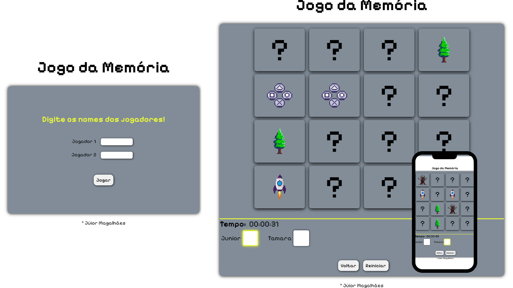

<h1 align="center">
  Jogo da Memória
</h1>

  

## 🚀 Tecnologias

Esse projeto foi desenvolvido com as seguintes tecnologias:

- HTML e CSS
- JavaScript

## 💻 Projeto

- O projeto propõe um jogo da memória interativo para dois jogadores, acompanhado de notificações personalizadas que alertam cada participante sobre o momento preciso de sua vez para jogar. Além disso, as cartas são automaticamente atualizadas sempre que uma nova partida é iniciada, garantindo uma experiência contínua e dinâmica.

- [Acesse o projeto finalizado, online](https://jogodamemoriajm.web.app/)

## :memo: Licença

Esse projeto está sob a licença Júnior Magalhães.

---

Feito por by Júnior Magalhães 
